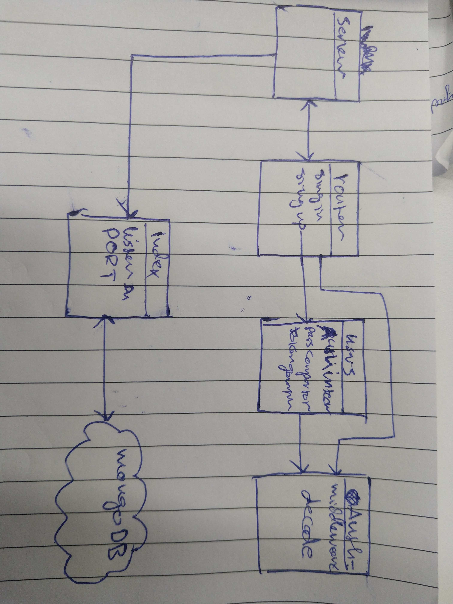

# LAB - Class 11

## Authentication

### Author: Naseem/Ibrahim

### Links and Resources

- [submission PR](https://github.com/401-advanced-javascript-ibrahim/authentication/pull/1)

### Setup

#### `.env` requirements (where applicable)

`PORT`=3000
`MONGODB_URI`=mongodb://localhost:27017/lab11
`SECRET`=hikari

#### How to initialize/run your application (where applicable)

- `npm run start`

#### UML

